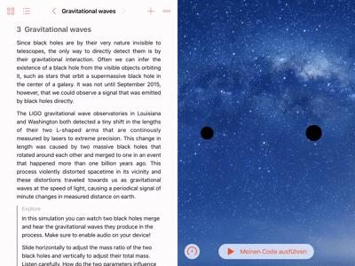

# Black holes in general relativity

In this [Swift playground book](http://www.apple.com/swift/playgrounds/) you’ll explore the physics of [black holes](https://en.wikipedia.org/wiki/Black_hole) in Albert Einstein's [theory of general relativity](https://en.wikipedia.org/wiki/General_relativity) with three interactive simulations on your iPad.

- **Schwarzschild trajectories:** Explore the possible trajectories of test particles around a spherically symmetric source.

  

- **Light deflection:** Discover optical effects that occur when a massive object lenses a background light source.

  

- **Gravitational waves:** Watch two black holes merge and hear the gravitational waves they produce in the process.

  

## Installation

1. [Download the Swift Playgrounds App](https://itunes.apple.com/WebObjects/MZStore.woa/wa/viewSoftware?id=908519492&mt=8&ls=1) on your iPad.
2. [Add the _Play with Gravity_ feed to the Swift Playgrounds App](https://developer.apple.com/ul/sp0?url=https://nilsleiffischer.de/relativity-playgrounds-feed/feed.json) and load the _Black holes_ playground.

**Alternatively**, this is the URL you can manually add to the Swift Playgrounds App to subscribe to the _Play with Gravity_ feed:

- _Play with Gravity_ feed URL: https://nilsleiffischer.de/relativity-playgrounds-feed/feed.json

You can also manually  [download the _Black holes_ playground](https://github.com/nilsleiffischer/black-holes-playground/raw/master/dist/Black%20holes.playgroundbook.zip) on your iPad or Mac:

  - **On your iPad:** Select _Open with "Playgrounds"_.

    

  - Or **on your Mac:** [AirDrop](https://support.apple.com/en-us/HT203106) the file to your iPad and select _Open with "Playgrounds"_.

    

## About this project

I created this Swift playground book as part of my application for the Apple WWDC 2017 scholarship. For all three simulations I modelled the physics of general relativity in Swift data structures and used the SpriteKit and UIKit frameworks of the iOS platform to visualise the dynamics on screen. To make the educational material engaging for the reader, I employ features of the iOS device such as touch input, motion control and audio feedback that encourage exploration of the scientific phenomena.

- Author: [Nils Leif Fischer](https://nilsleiffischer.de)

Copyright (c) 2017 Nils Leif Fischer
